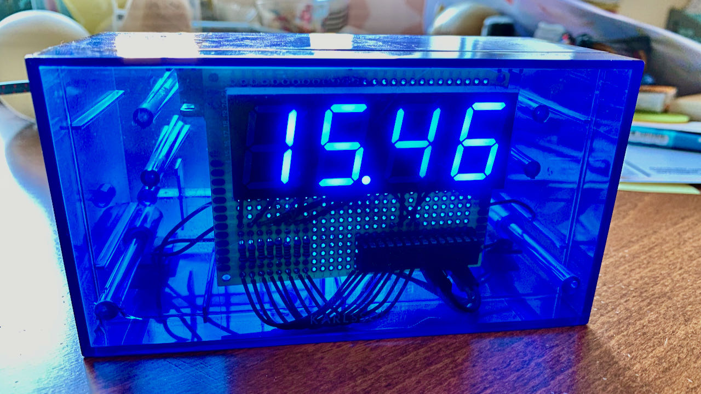
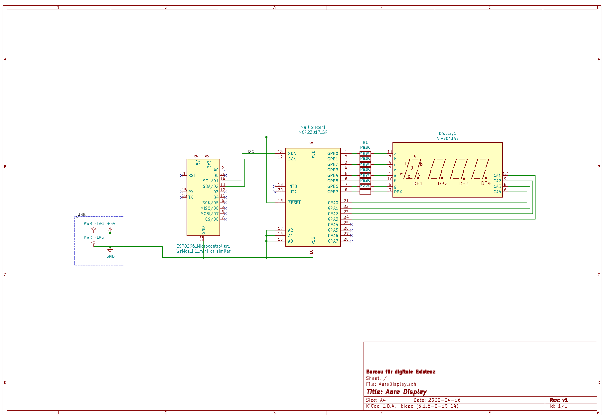

# Aare Display

ESP8266 based display of the current Aare river temperature on a seven-segment display.

(Long time in the making, but finally finished during the Corona lockdown in spring 2021.)

## Structure

- The housing is an old decommissioned alarm clock.
- Contains an [ESP8266 NodeMCU V3 Development Board](https://en.wikipedia.org/wiki/NodeMCU), stuck on a breadboard and powering the whole thing via USB.
- Uses [WifiManager](https://github.com/tzapu/WiFiManager) to search and connect to a WLAN.
- Uses the [Arduino Wire library](https://www.arduino.cc/en/Reference/Wire) to set up the I2C bus.
- A [MCP21017 I/O expander](https://www.microchip.com/wwwproducts/en/MCP23017) is put on the I2C bus.
- The MCP connects to the LEDs on the [Sparkfun 7-segment-display](https://www.sparkfun.com/products/11408).
- Uses the HTTP client to fetch the current Aare river temperature in Bern, Schönau from the [Aare.guru API](https://aareguru.existenz.ch).

## Important Files

### `aareDisplay.ino`

A sketch file for the [Arduino IDE](https://www.arduino.cc/en/software) containing all the code running on the ESP8266 microcontroller.

### `AareDisplay.sch`

[KiCad](https://kicad.org) schematics file containing the wiring information.

Note that I'm not an electrical engineer by trade and this has been my first time writing up a circuit.

Note also that the I2C-bus pins are correctly wired on the schematics, I fixed them in code.

### `development_notes.md`

Archived development notes (German).

## Known Issues

- Display refresh: Every time the display fetches new data via HTTP (Every 5 minutes), it can no longer refresh the display LEDs and it flickers.
- Floating point value: In order to calculate the digit characters, a division operation on a floating point number is made. Which on this CPU can lead to small +/- discrepancies already on the second digit after the point.

## Possible Improvements

- Nicer wiring: By changing the order of the output pins of the MCP port expander to better correspond to the input pins of the display, you might get a nicer looking circuit board.
- OTA-Updates for the firmware.
- Maybe using a two-core EPS32 would allow updating on one core and driving the LED display on the other core, preventing the flickering.

## Status

Done.

The display runs multiple months without issues.

## Author

Christian Studer, <cstuder@existenz.ch>

## License

[MIT](LICENSE)
